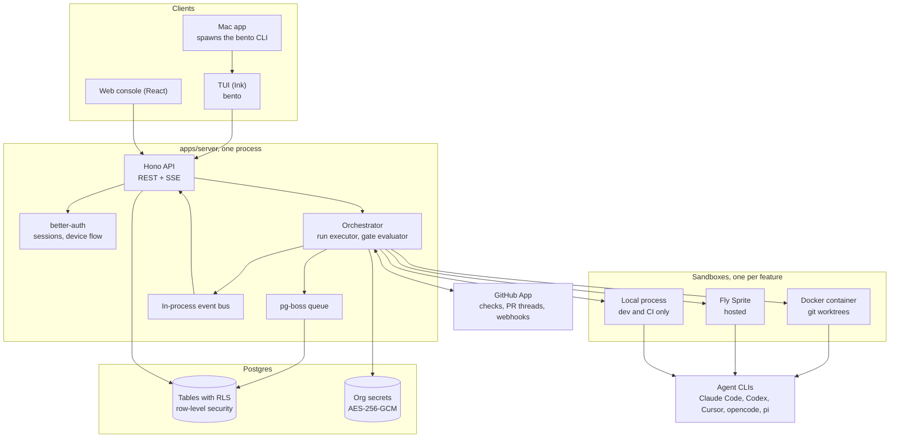
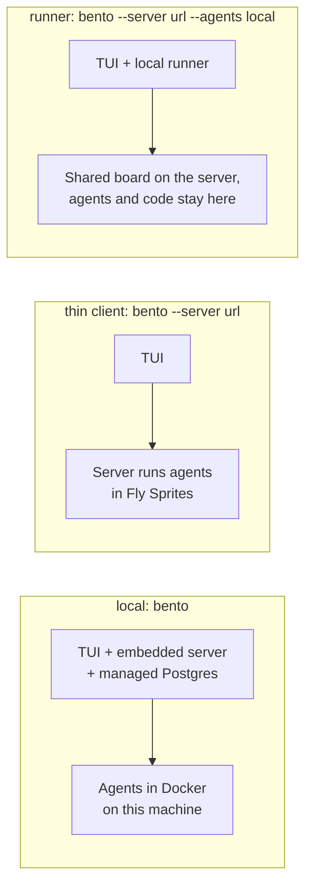
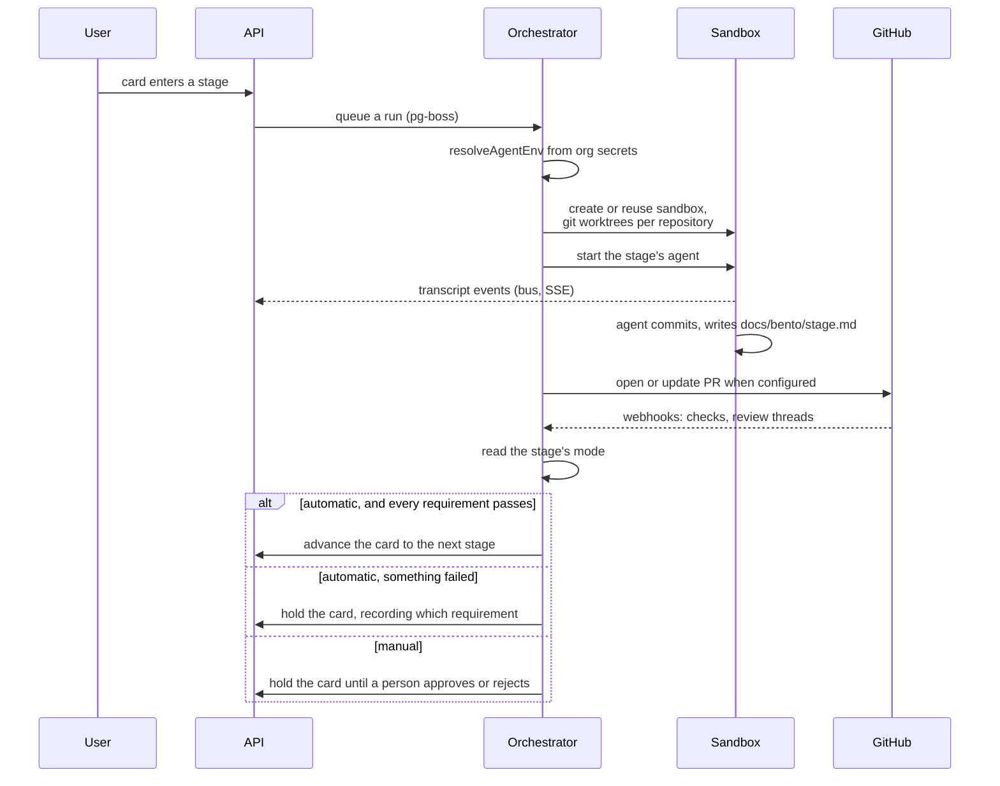
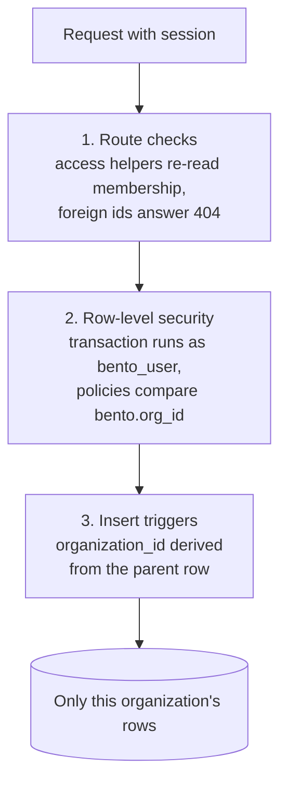

# System architecture

How the pieces of Bento fit together. The diagrams are Mermaid, which GitHub renders inline. For the tables themselves, and how tenancy is carried through them, see [Database schema](/docs/database-schema).

## The system at a glance

Every client talks to the same Hono API. The server owns the orchestrator and the queue, Postgres is the only stateful dependency, and agents run inside sandboxes that the server (or a runner machine) manages through a common driver interface.

The TUI can also embed the entire server block in its own process, which is what `bento` with no arguments does: it brings up Postgres in a managed container, runs migrations, and serves the API on a loopback port.

## The three modes

Where the board lives and where agents run are independent choices.

In runner mode the machine claims runs the server holds for it, so the board, run history, and transcripts are shared while checkouts and agent credentials never leave the machine. Runs queued for an offline runner wait for it.

## Life of a feature card

Stages hand context to each other through committed artifact files (`docs/bento/<stage>.md`), so a card designed by one agent can be implemented by a different one. Gates are re-evaluated when a run finishes, when a GitHub webhook arrives, on manual re-check, and every five minutes as a fallback.

## Tenant isolation, three layers

Multi mode keeps organizations apart with three mechanisms that fail differently, so no single mistake is enough to leak data.

Background workers deliberately skip the role switch: one process executes runs and evaluates gates for every tenant. SSE streams are excluded from the tenant transaction so they do not hold a pooled connection for the length of an agent run; they check access at setup and then read from the event bus.

## Credentials

Agent API keys belong to the organization, never the server. They are saved through `bento setup`, the web console, or the API, encrypted at rest, and resolved per run. In multi mode a sandbox only ever sees the owning organization's keys. Local mode layers stored keys over the process environment, because there is one trusted user and no tenant boundary.

A subscription can stand in for a key. Locally, login sharing mounts each tool's own config read only and, for Claude Code on macOS, forwards a short lived token read from the Keychain per run. A server that runs where the login is not (a container, a hosted deployment) uses the long lived token from `claude setup-token` instead, stored as `CLAUDE_CODE_OAUTH_TOKEN` in the environment or as a secret; it satisfies the credential check exactly as a key does.

GitHub credentials follow the same boundary. Each organization installs the Bento GitHub App for selected repositories. The server resolves that installation per run and narrows its short-lived token to the repository being transferred. Docker worktrees are exported as credential-free Git bundles before a trusted temporary checkout pushes them. For Sprites, the server clones privately into a trusted temporary checkout, uploads a credential-free seed bundle, and later downloads the agent's committed bundle for publishing. Installation tokens never enter a sandbox, and sandbox-controlled remotes are never used for a push.
