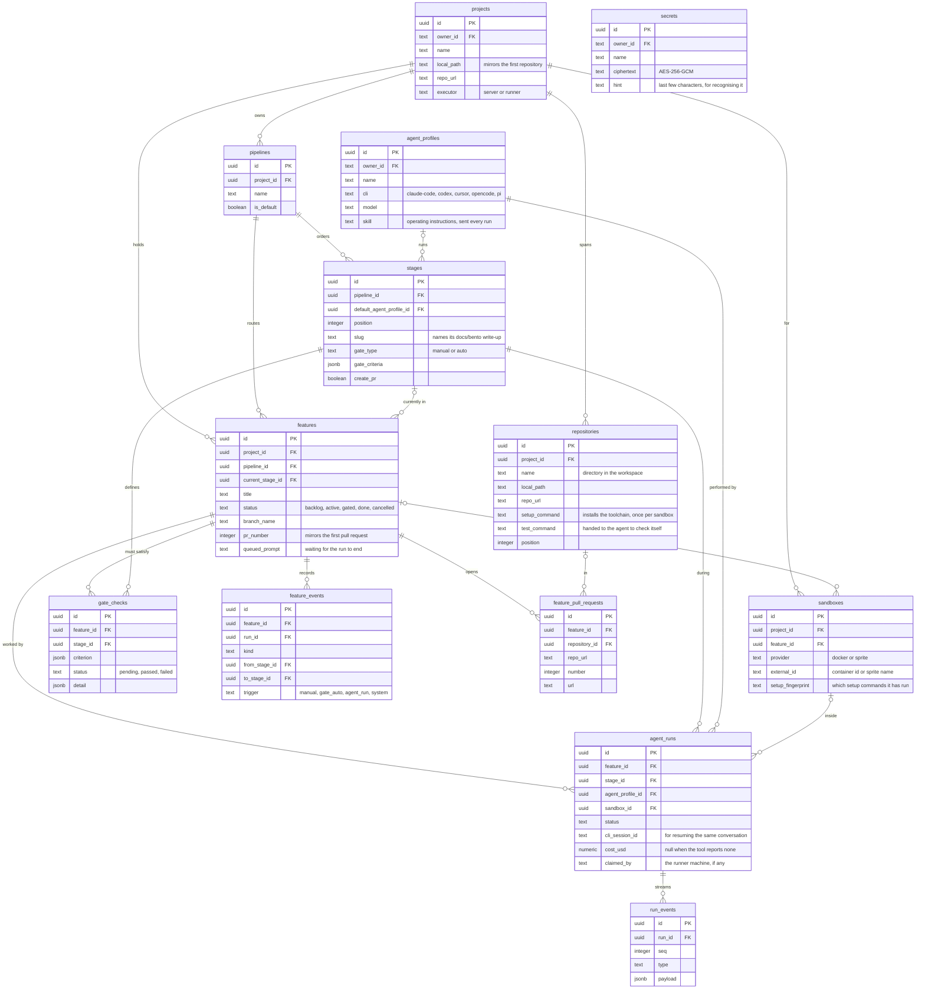
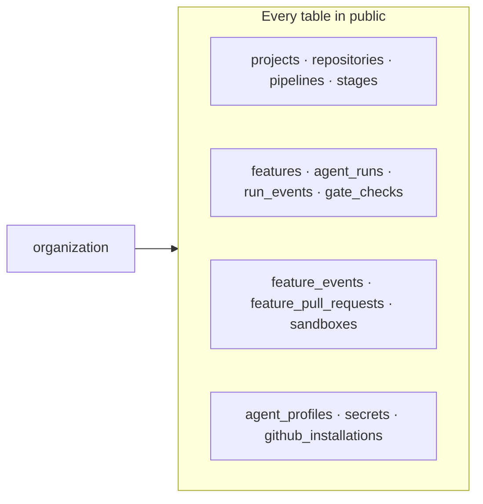

# Database schema

Every table Bento owns, in two schemas. The diagrams are Mermaid, which GitHub renders inline.

`identity` holds better-auth's tables. They live in their own schema so they never collide with Supabase's reserved `auth` schema when somebody points Bento at a Supabase Postgres. `public` holds everything else.

One convention runs through the whole of `public` and is worth reading before the diagrams: **every table carries its own `organization_id`, denormalized from its parent.** It is not the real parent relationship; it is what lets row-level security be a column comparison rather than a join up four levels. The diagrams below leave those edges out, because drawing fifteen lines into `organization` hides the structure they are drawn on top of. There is a diagram for them at the end.

## Identity and tenancy

```mermaid
erDiagram
    user ||--o{ session : "signs in"
    user ||--o{ account : "authenticates with"
    user ||--o{ member : "belongs through"
    organization ||--o{ member : "has"
    organization ||--o{ invitation : "offers"
    user ||--o{ invitation : "sent by"
    organization ||--|| organization_policies : "settles"
    organization ||--o| github_installations : "connects"
    user ||--o{ github_installations : "installed by"

    user {
        text id PK
        text email UK
        boolean email_verified
        text name
    }
    account {
        text id PK
        text user_id FK
        text provider_id "credential, github, google"
        text account_id "the id that provider knows"
        text password "hash, credential only"
        text access_token "OAuth only"
    }
    session {
        text id PK
        text token UK
        text user_id FK
        text active_organization_id "which org this session acts in"
        timestamp expires_at
    }
    organization {
        text id PK
        text slug UK
        text name
    }
    member {
        text id PK
        text organization_id FK
        text user_id FK
        text role "owner, admin, member"
    }
    invitation {
        text id PK
        text organization_id FK
        text inviter_id FK
        text email
        text status
        timestamp expires_at
    }
    organization_policies {
        text organization_id PK
        boolean restrict_network
        boolean include_stage_notes_in_pr
    }
    github_installations {
        uuid id PK
        text organization_id FK
        text installation_id
        text account_login
    }
    verification {
        text id PK
        text identifier "email being confirmed or reset"
        text value
        timestamp expires_at
    }
    device_code {
        text id PK
        text user_code "typed into the browser"
        text user_id "null until a session claims it"
        text status
    }
    rate_limit {
        text id PK
        text key "route plus caller"
        integer count
    }
```

`user` is the person; `account` is one way that person proves it, one row per sign-in method. The password hash lives on `account`, not on `user`, and a second `account` row is how a password login and a GitHub login become the same person.

`verification`, `device_code`, and `rate_limit` hang off nothing: they are short-lived rows keyed by an email, a code, or a caller.

## Projects, pipelines, and cards

The shape of the product. A project spans repositories and owns a pipeline of stages; a card (`features`) moves through those stages, and each move is worked by an agent run.

Some of these relationships are worth stating in words, because a crow's foot does not carry the reason:

- **`features.current_stage_id` is where a card is now**, while `agent_runs.stage_id` is where a run happened. A done card keeps the stage it finished in, so "is it in a stage" is not the same question as "is it live".
- **`sandboxes` are per feature, not per run.** A card's machine outlives the run that created it, which is what lets the second stage start warm and why `setup_fingerprint` lives here rather than on a run.
- **`feature_pull_requests` is per repository.** A card spanning a frontend and a backend has one row in each and is only finished when both are; `features.pr_number` mirrors the first, for the single link the board shows.
- **`secrets` belongs to an organization, never to the server.** Agent credentials are read from here, and a hosted deployment never falls back to its own environment.

## Where organization_id goes

Every table above also carries an `organization_id`, cascading on delete, and this is the layer the diagrams omit. It is denormalized from the parent row rather than derived per query.

Three layers keep a tenant's rows to itself, and each catches something the others do not:

1. **Route checks** re-read `member` per request, so removing somebody from an organization takes effect immediately.
2. **Row-level security** confines every query to the caller's organization, so a forgotten `WHERE` returns nothing rather than another tenant's rows. It reads the session's active organization, which lags membership changes, so it does not replace layer 1.
3. **Insert triggers** derive `organization_id` from the parent row, so no insert can forget to tag its tenant.

In local mode there are no organizations, and `organization_id` is null everywhere. RLS is skipped entirely for superusers and any role with `BYPASSRLS`; requests run as `bento_user`, which has neither.

## Deletes

The delete rules are part of the design rather than a default, and they fall into three groups:

| Rule | Where | Why |
| --- | --- | --- |
| `cascade` | a row's real parent: project to repositories, feature to runs, run to events, organization to everything | the child has no meaning without the parent |
| `set null` | `sandboxes.feature_id`, `feature_events.run_id`, `feature_pull_requests.repository_id` | the record outlives what it pointed at: a pull request stays worth reading after its repository leaves the project |
| `no action` | `projects.owner_id`, `agent_runs.agent_profile_id`, `features.current_stage_id` | deleting would silently rewrite history, so it is refused and the caller has to deal with it |

That third group is why an agent with recorded runs cannot be removed, and why removing a stage is refused while any card is sitting in it.
